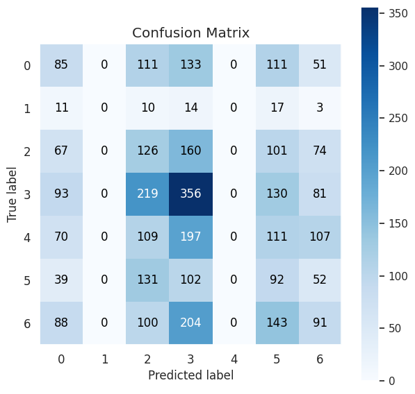

# face-emotion-recognition

# Overview
This project involved the recognition of face emotions taken from real time image footage from the user's camera. The Keras library was utilized and the model was built in Google Colab to utilize a GPU for faster training. The deployed model allows the user to capture an image from his camera, detects the user's face using haarcascade and assigns to it the appropriate emotion. The model is able to detect with good accuracy between the following emotions: ’anger’, ’disgust’, ’fear’, ’happiness’, ’sadness’, ’surprise’ and ’neutral’.

# Data
The training dataset was derived from Kaggle: https://www.kaggle.com/code/gauravsharma99/facial-emotion-recognition/data
It composed of 35.887 face images, split between the emotion categories, as seen in the following plot. Some of the face images belonged to cartoons or anime, but the majority seemed to be of real people. An overview of some of them can be seen in the gray-scaled image below. Provided were also a validation and a test set that shared the same classes' imbalance as the training set.

  

  

# Model creation
## Chosen model
A Convolutional Neural Network with 5 convolutional blocks was created. CNNs are well suited to this task because they can automatically learn and extract the relevant features of the image using convolutional layers. These layers apply a set of filters to the input image to detect edges, shapes, and patterns in the image. In addition, they use pooling layers to reduce the dimensionality of the feature maps while preserving the most important information, which helps to avoid overfitting. Finally, the fully connected layers at the end of the network can use the extracted features to classify the image into one of several emotion categories. 

## Model training
Data augmentation was utilized in training through ImageDataGenerator. Adam was used as an optimizer and the categorical cross-entropy as a loss function. The model was trained for 40 epochs. 

## Model evaluation
The model was evaluated on the validation set. The accuracy and loss of the model through the epochs can be seen in the following figures.

  

  

## Model testing
As indicated by the validation set the model was quite good in predicting the "happy" class, which is logical because of the larger number of instances it had. The results of the test set were similar. The other classes performed more poorly, which could be a result of the lower amount of data they had. For two classes no value was predicted. The model achieved a total accuracy of 67% on the test set. All in all its results were adequate but further work can be done to improve them.

  

## Model deployment
The created model was considered adequate enough to deploy in the field. The data being passed to it were real-time footage from the user's camera. Whenever the user decides a picture is captured. The user's face is detected using haarcascade and the model assigns to it an emotion. "Happy" pictures were correctly classified all the time, while the model was also good enough in recognizing the other emotions as well. Where it failed most of time, was in recognizing disgust, which is logical considering the model's poor performance on that class due to the small amount of samples.

# Future work
Several techniques were employed, along with hyperparameter tuning to address the classes' imbalance towards a more accurate model. Besides hyperparameter tuning, oversampling (SMOTE), undersampling (SMOTE-ENN), a mixture of both and also introduction of class weights towards a balanced distribution were performed, however the results were always significantly worse than simple data augmentation. Three more architectures of CNN were also tested, with 3,4 and 6 covolutional blocks but they tended to not generalize well to the validation and test sets.

Other strategies that could be employed for the creation of a more accurate emotion classifier would involve either the introduction of more similar data from other datasets to end up with richer sets or the replacement of the CNN model with another pretrained model for similar tasks (like the VGG19 model).

Finally, the footage capturing process could be further enhanced so that the model can assign an emotion to real-time footage of a face, without the need of capturing a picture from that footage for it to work with.