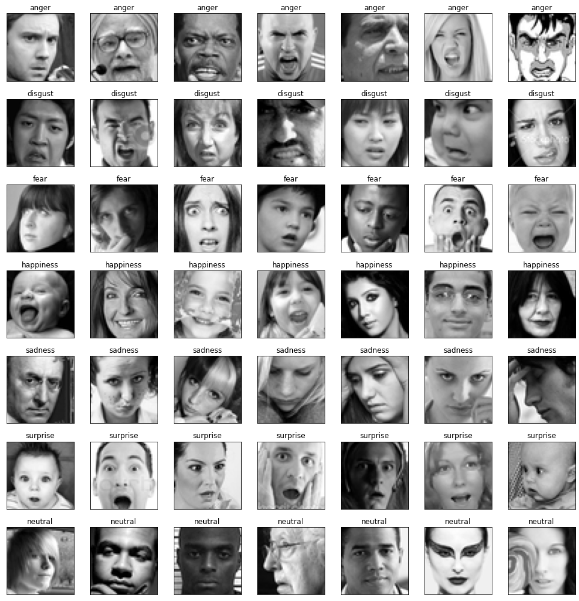

# face-emotion-recognition

# Overview
This project involved the recognition of face emotions taken from real time image footage from the user's camera. The Keras library was utilized and the model was built in Google Colab to utilize a GPU for faster training. The deployed model allows the user to capture an image from his camera, detects the user's face using haarcascade and assigns to it the appropriate emotion. The model is able to detect with good accuracy between the following emotions: ’anger’, ’disgust’, ’fear’, ’happiness’, ’sadness’, ’surprise’ and ’neutral’.

# Data
The training dataset was derived from Kaggle: https://www.kaggle.com/code/gauravsharma99/facial-emotion-recognition/data
It composed of 35.887 face images, split between the emotion categories, as seen in the following plot. Some of the face images belonged to cartoons or anime, but the majority seemed to be of real people. An overview of some of them can be seen in the gray-scaled image below. Provided were also a validation and a test set that shared the same classes' imbalance as the training set.

  

  

# Model creation
## Chosen model
A Convolutional Neural Network with 5 convolutional blocks was created. CNNs are well suited to this task because they can automatically learn and extract the relevant features of the image using convolutional layers. These layers apply a set of filters to the input image to detect edges, shapes, and patterns in the image. In addition, they use pooling layers to reduce the dimensionality of the feature maps while preserving the most important information, which helps to avoid overfitting. Finally, the fully connected layers at the end of the network can use the extracted features to classify the image into one of several emotion categories. 

## Model training
Data augmentation was utilized in training through ImageDataGenerator. Adam was used as an optimizer and the categorical cross-entropy as a loss function. The model was trained for 40 epochs. 

## Model evaluation
The model was evaluated on the validation set. The accuracy and loss of the model through the epochs can be seen in the following figures.

  

  

  

